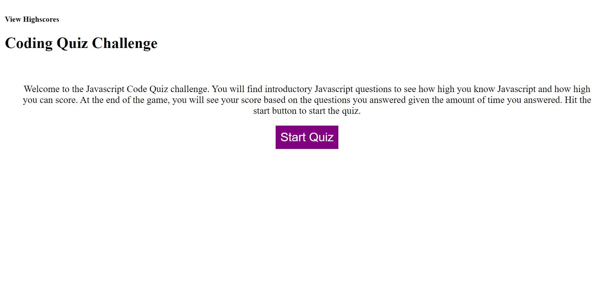
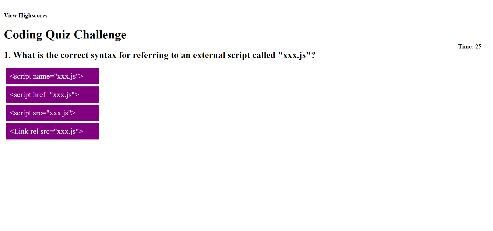
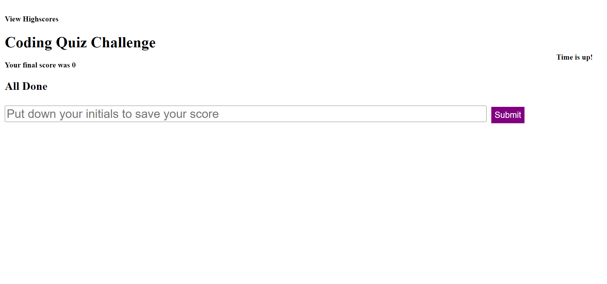
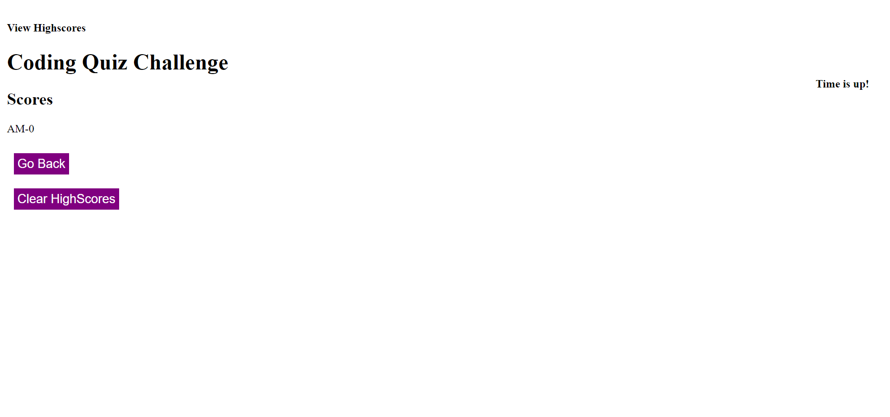

# Javascript code-quiz

## Summary

This application is a simple Javascript code quiz with 4 questions and a timer of thirty seconds. Don't let the 4 intro questions fool you. The answers you get wrong, 5 additional seconds will be deducted for your time to do the quiz. At the end of the quiz, you can keep your high scores in your own local storage and compete against other users. The application is simple and easy to use as it is easy to start the quiz, see what questions you got right or wrong and big purple buttons to reset the game, clear your high scores and submit your initials to be saved in the local storage.

## Screenshot 

## Link
[GitHub Javascript Code Quiz](https://midth002.github.io/code-quiz/)